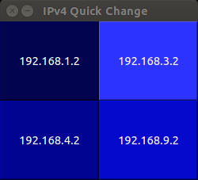
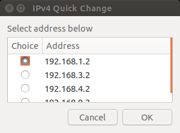

# quickip.py, shortcut to change IP address

This repository contains two different python scripts, **quickip.py** and **quickip-zenity.py**, which can be used as a shortcut to change your local IP address. The scripts are designed to work in **debian** based operating systems. To make the scripts work correctly, you need to set up a couple of things in your environment. You can read instructions for the set up [here](http://offorensics.com/shortcut-change-ip-address/ "here").

_quickip.py GUI_

_quickip-zenity.py GUI_
